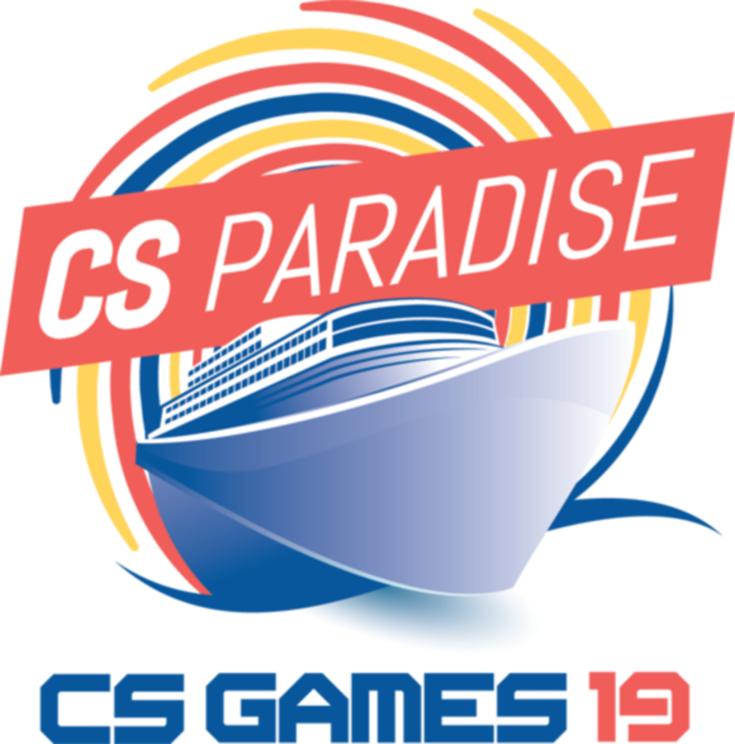

# CS Games
## Présenté par 

Corinne Pulgar - Adjointe Compétition  
Philippe Van Velzen - VP Compétition

# C'est quoi ?

## Selon le site officiel
> Les Jeux CS sont une compétition interuniversitaire regroupant des épreuves touchant différents domaines de l'informatique.

##
> Des problèmes de logique et d'algorithmes, en passant par des jeux vidéos, des activités à caractère social et, certainement, 
des défis de programmation y sont tous présentés au cours d'une fin de semaine.
[csgame.org](http://csgames.org/corpo/fr/)

# Concrètement, c'est...
## 3 jours de compétitions 

## 3 jours de party

## Une trentaine défis

## Un jeopardy ouvert durant toute la compétition

## En vrai, ça ressemble à quoi
+ Prog
+ Flashout
+ Party jusqu'à ...
+ Réveille avant 8h
+ Prog
+ Party jusqu'à ...
+ Réveille avant 8h
+ Prog
+ Banquet chic (vin à volonté)
+ Encore plus gros party!
+ Dort toute la journée

# Précédemment aux CS games
##

  
   
  
  

## Depuis combien de temps?
 
2003 
et aucune victoire... encore!

## Combien d'université?
Plein... Genre plus que 10!

# Objectif
## Gagner des petits prix

## ... des petits trophées

## ... et un GROS!

# Photos des CS Games 2018
##

##

##

##

# Le thème de cette année
##
{height=600}

Organisé par la polytechnique

[CS Games 2019](http://2019.csgames.org)

## Lore
> Nous sommes en 2003. 
La version 2.6 du kernel linux fait son apparition tant attendu sur le marché. Les disciples de Linux ne peuvent plus attendre d’utiliser la toute nouvelle fonctionnalité révolutionnaire: la parallélisation d’une infinité de thread virtuel. Peu après cette sortie, la toute première édition des CS Games a lieu à l’université McGill. L’organisation, désirant profiter de ce nouveau kernel, met en place une compétition de low level pour explorer cette nouvelle fonctionnalité.

##
> Malheureusement, l’impensable se produit lors de la compétition : **L’interaction entre chacun des threads a altéré le continuum de l’espace-temps**.

## 
> On invite donc les participants à bord du CS Paradise pour s’affronter dans différentes compétitions permettant de **réunir les univers**.

# Compétences requises
## Aimer la prog et être motivé <3
 
 
Pour vrai c'est tout.

## Qualifications
Ouverture le 14 janvier 00:00:02

Fermeture le 27 janvier 23:59:58

Il y a deux équipes, une de noobs et une de pro...

## En attendant
Slack : #csgames

@corinnep   &   @philippe

www.ctf.ageei.uqam.ca

## Viens donc, ça va être nice!

<!---
pandoc -s -t revealjs -o pres.html csgames.md -V revealjs-url=https://revealjs.com -Vheight=900 --slide-level=2
-->

