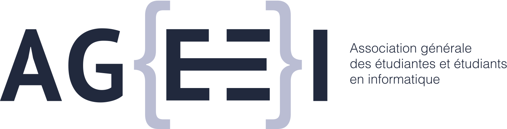
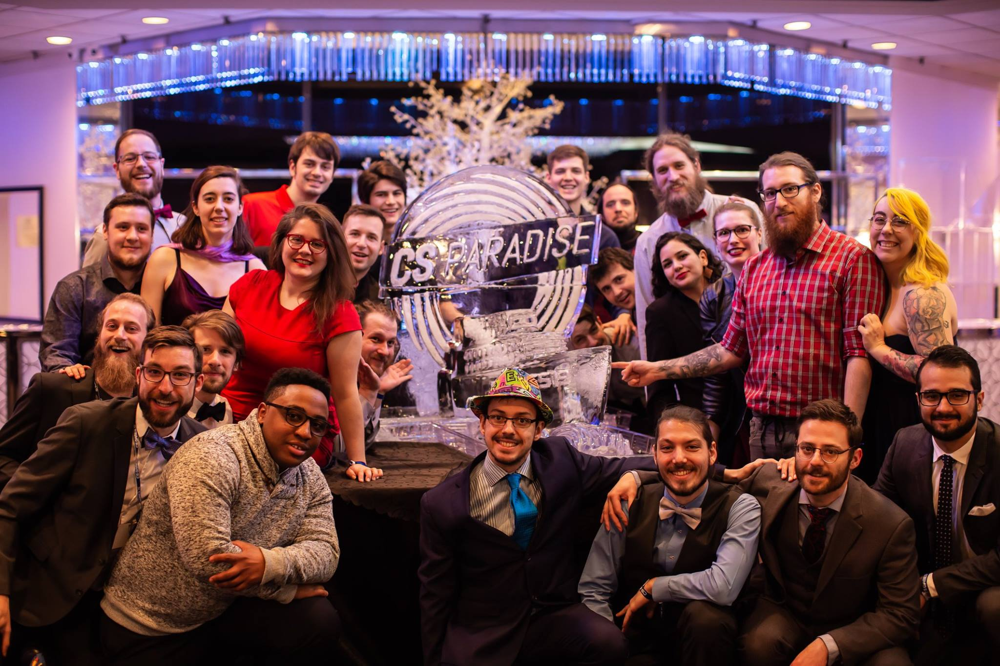
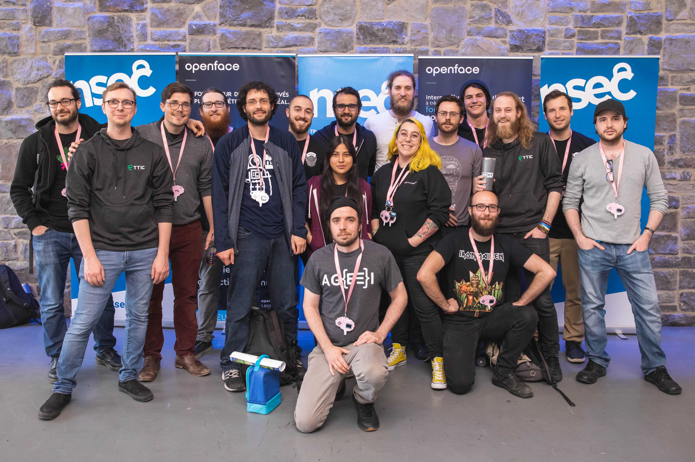
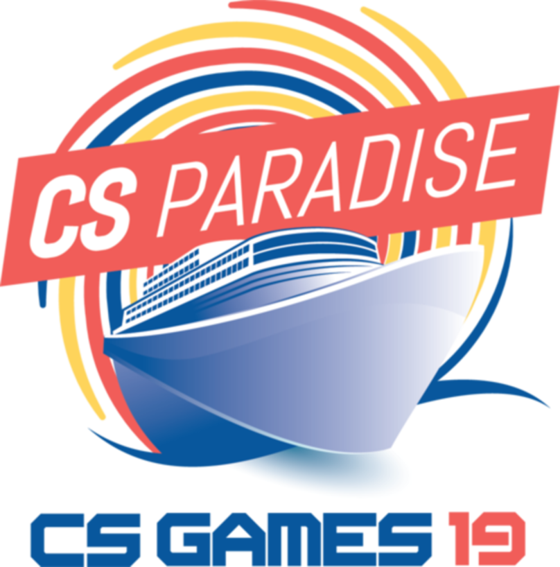
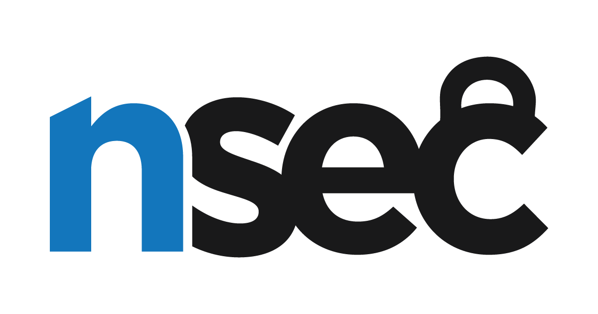
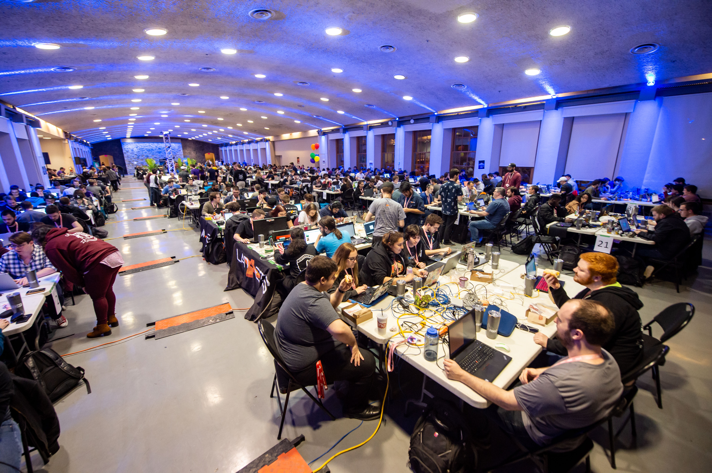

# Intro to Web Hacking

## Presented by 

Corinne Pulgar

# A little bit about me
## Some credentials
+ Bachelor in drama
+ Computer Science student at UQAM
+ Security consultant at Alternatives
+ Competition organizer

## First competition in September 2018

  
   
  
  

# What's hacking ?

## A quote from Richard Stallman
> It is hard to write a simple definition of something as varied as hacking, but I think what these activities have in common is playfulness, cleverness, and exploration. Thus, hacking means exploring the limits of what is possible, in a spirit of playful cleverness. Activities that display playful cleverness have "hack value".
 
https://stallman.org/articles/on-hacking.html

## To resume 
+ Playfulness
+ Cleverness
+ Exploration

## But what about BAD hackers ?

## 
+ Hackers
+ Crackers
+ Script kiddies
+ Black hats, white hats and fifty shades of grey hats

# Capture the Flag

## What's a CTF ?
It looks a lot like this ...

## Finding the flag
+ A simple string of characters
+ With a specific format : LHL{This_is_a_flag}
+ Usually with bad puns

## Different kinds of hacking
+ Reverse ingeneering
+ Cryptography
+ Forensics
+ Steganography
+ Binary exploitation / Pwn
+ <em>Web hacking</em>

## Some popular competitions on site
+ Hackfest
+ Northsec
+ MontreHack

## And online :
+ RingZero
+ CTF365
+ HackTheBox
+ OverTheWire
+ Find all of them on CTFTime

# A (very) small glimpse of web hacking
## PicoCTF

 
https://picoctf.com/

## Challenge 1 : Inspect Me
Following the breadcrumbs path
 
http://2018shell1.picoctf.com:53213/

## Challenge 2 : Irish Name Repo
Extracting precious informations
 
http://2018shell.picoctf.com:59464/

## Challenge 3 : Client Side is Still Bad
Never trust the client!
 
http://2018shell.picoctf.com:8249/

## Challenge 4 : Logon
Sugar is bad for you
 
http://2018shell.picoctf.com:37861/